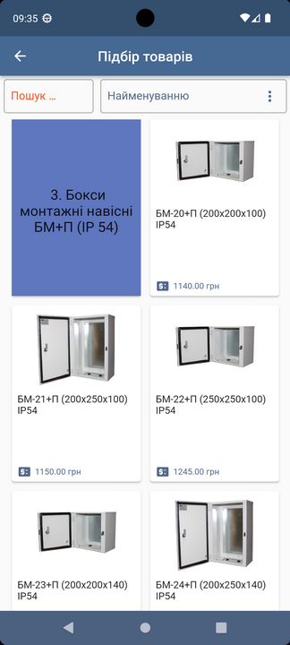

# Bilmax

mastorramos@gmail.com

2024 (c) 

on Flutter!

https://play.google.com/store/apps/details?id=com.bilmax

Unique corporate application on Flutter!

The purpose of this application is to create
document "Technical specifications" and
document "Buyer's Order" for sending
into the 1c accounting system: UTP Enterprise
 (Management of a trading enterprise).

For operation it is used in off-line mode.

The exchange takes place via ftp transport.

Technologies and main dependencies used:
 Sqflite, path provider, network image
 Ftpconnect, mail, http
 Image, permission handler
 Printing, pdf render, dotenv….

//**************************************

Унікальний корпоративний додаток на Flutter!

Завдання цієї програми полягає у створенні
документа «Технічне завдання» та
документа «Замовлення покупця», для відправки
в облікову систему 1с:Підприємство УТП
 (управління торговим підприємством).

Для роботи використовується в режимі off-line.

Обмін відбувається ftp транспортом.

Використовувалися технології та основні залежності:
 Sqflite, path provider, network image
 Ftpconnect, mail, http
 Image, permission handler
 Printing, pdf render, dotenv ….

//**************************************

Уникальное корпоративное приложение на Flutter !

Задача этого приложения заключается в создании 
документа «Техническое задание» и 
документа «Заказ покупателя», для отправкой 
в учетную систему 1с:Предприятие УТП
 (Управление торговым предприятием).
 
Для работы используется в off-line режим.
 
Обмен происходит ftp транспортом. 

Использовались технологии и основные зависимости:
  Sqflite, path provider, network image
  Ftpconnect, mail, http
  Image, permission handler
  Printing, pdf render, dotenv ….

   

